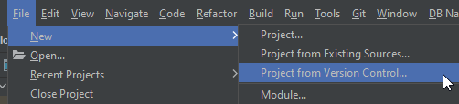
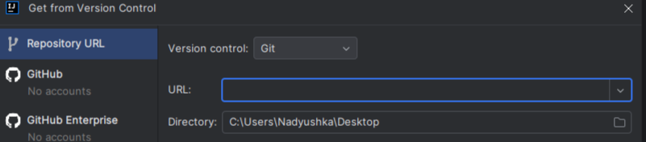

# Дипломный проект по профессии «Тестировщик»

## Тема — автоматизация тестирования комплексного сервиса, взаимодействующего с СУБД и API Банка.

## Инструкция по запуску

1. Для запуска авто-тестов нужно заранее установить и
   запустить [Docker Desktop](https://github.com/netology-code/aqa-homeworks/blob/master/docker/installation.md) на
   локальной машине

2. Запустить IntelliJ IDEA

3. Склонировать репозиторий командой в консоли:
   `git clone https://github.com/Nadezhda-VP/Diploma-project-in-the-profession-of-Tester-.git`

Либо воспользоваться интерфейсом *IntelliJ IDEA:*

#### В поле `URL` вставить ссылку на репозиторий:

     https://github.com/Nadezhda-VP/Diploma-project-in-the-profession-of-Tester-.git

#### Нажать

    Clone

## Работа с базой данных MySQl.

#### 1. Запуск контейнера docker:

    docker-compose up

#### 2. Запуск приложения:

    java '-Dspring.datasource.url=jdbc:mysql://localhost:3306/app' -jar ./artifacts/aqa-shop.jar

#### 3. Запуск тестов:

    ./gradlew clean test '-Ddb.url=jdbc:mysql://localhost:3306/app'

#### 4. Сформировать отчет:

    ./gradlew allureReport

#### 5. Открыть отчет в браузере командой:

    ./gradlew allureServe

#### 6. Остановить работу приложения командой в консоли:

    Ctrl+C

#### 7. Остановить контейнер:

    docker compose down

## Работа с базой данных Postgres.

#### 1. Запуск контейнера docker:

       docker-compose up

#### 2. Запуск приложения:

       java '-Dspring.datasource.url=jdbc:postgresql://localhost:5432/app' -jar ./artifacts/aqa-shop.jar

#### 3. Запуск тестов:

       ./gradlew clean test '-Ddb.url=jdbc:postgresql://localhost:5432/app'

#### 4. Сформировать отчет:

       ./gradlew allureReport

#### 5. Открыть отчет в браузере командой:

       ./gradlew allureServe

#### 6. остановить работу приложения командой в консоли:

       Ctrl+C

#### 7. Остановить контейнер:

       docker compose down