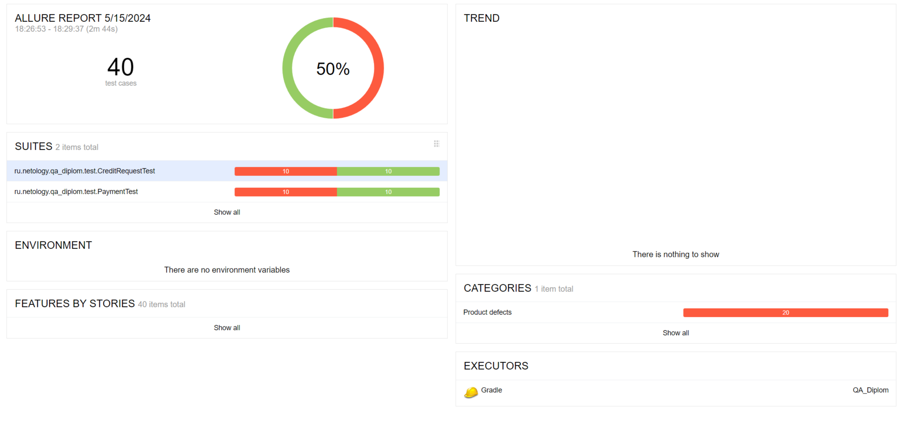

# Отчётные документы по итогам тестирования

## Краткое описание

Реализована автоматизация тестирования комплексоного сервиса для покупки тура в Мараккеш

## Количество тест-кейсов

Общее количество тест-кейсов для обеих СУБД - 40 шт

## Процент успешных и не успешных тест-кейсов

для обеих *СУБД*
> успешных: 50%

> неуспешных: 50%

## Общие рекомендации

По обнаруженным дефектам
созданы [Issues](https://github.com/Nadezhda-VP/Diploma-project-in-the-profession-of-Tester-/issues) баг-репорты и
рекомендации по улучшению. Баг-репорты необходимо принять в работу.